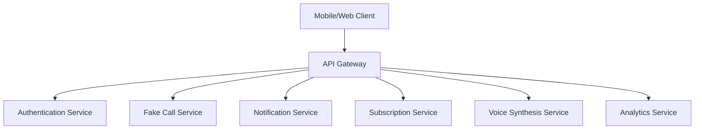

# Fake Call Notification System - Comprehensive API Documentation

## Overview

This document provides complete API documentation for the Fake Call Notification System, including REST endpoints, WebSocket events, service interfaces, and integration patterns for the OffScreen Buddy Pro tier feature.

## Table of Contents

1. [Service Architecture](#service-architecture)
2. [Core Service APIs](#core-service-apis)
3. [REST API Endpoints](#rest-api-endpoints)
4. [WebSocket Events](#websocket-events)
5. [Data Models](#data-models)
6. [Error Handling](#error-handling)
7. [Authentication & Security](#authentication--security)
8. [Rate Limiting](#rate-limiting)
9. [Webhooks](#webhooks)
10. [SDK Integration](#sdk-integration)

## Service Architecture

### Service Layer Structure



### Core Services

#### FakeCallService
- **Purpose**: Main orchestrator for fake call functionality
- **Responsibilities**: Call lifecycle management, Pro tier validation, call scheduling
- **Dependencies**: NotificationService, SubscriptionService, VoiceService

#### VoiceSynthesisService  
- **Purpose**: Handles text-to-speech and audio generation
- **Responsibilities**: Voice profile management, audio synthesis, quality control
- **Dependencies**: VoiceService, AudioManager

#### CallerIDService
- **Purpose**: Manages caller ID generation and validation
- **Responsibilities**: Safety validation, name database, number generation
- **Dependencies**: SafetyService, Database

## Core Service APIs

### FakeCallService Interface

```typescript
interface IFakeCallService {
  // Service Lifecycle
  initialize(): Promise<ServiceResult<void>>;
  dispose(): Promise<void>;
  
  // Call Management
  scheduleCall(config: CallScheduleConfig): Promise<CallSchedulingResult>;
  triggerCall(callId: string): Promise<CallInitializationResult>;
  endCall(callId: string): Promise<ServiceResult<void>>;
  getCallStatus(callId: string): Promise<CallStatusResult>;
  
  // State Management
  handleCallAction(callId: string, action: CallAction): Promise<ServiceResult<void>>;
  getActiveCalls(): Promise<ActiveCallsResult>;
  
  // Preferences
  getUserPreferences(userId: string): Promise<PreferencesResult>;
  updateUserPreferences(userId: string, preferences: Partial<FakeCallPreferences>): Promise<ServiceResult<void>>;
  
  // Analytics
  getCallHistory(userId: string, options: HistoryOptions): Promise<CallHistoryResult>;
  getAnalytics(userId: string, period: AnalyticsPeriod): Promise<AnalyticsResult>;
}

// Service Result Types
interface ServiceResult<T> {
  success: boolean;
  data?: T;
  error?: ServiceError;
  metadata: {
    timestamp: Date;
    requestId: string;
    duration: number;
    rateLimitInfo?: RateLimitInfo;
  };
}

// Error Types
interface ServiceError {
  code: string;
  message: string;
  details?: Record<string, any>;
  recoverable: boolean;
  retryAfter?: number;
}
```

## REST API Endpoints

### Base Configuration

```typescript
// Base URL Configuration
const API_CONFIG = {
  baseURL: process.env.API_BASE_URL || 'https://api.offscreenbuddy.com/v1',
  version: 'v1',
  timeout: 30000,
  retries: 3,
};

// Authentication Headers
const AUTH_HEADERS = {
  'Authorization': 'Bearer {access_token}',
  'Content-Type': 'application/json',
  'X-API-Version': API_CONFIG.version,
};
```

### Call Management Endpoints

#### Schedule a Fake Call
```http
POST /fake-calls/schedule
Authorization: Bearer {access_token}
Content-Type: application/json

{
  "callerInfo": {
    "name": "Sarah Johnson",
    "phoneNumber": "+1-555-0123",
    "displayName": "Dr. Sarah Johnson",
    "callerType": "safe"
  },
  "voiceProfileId": "professional_female",
  "callType": "incoming",
  "priority": "normal",
  "scheduledFor": "2024-01-15T14:30:00Z",
  "callDuration": 30,
  "audioMessage": "Hi, this is Dr. Johnson. I hope you're doing well.",
  "autoAnswer": false,
  "smartScheduling": {
    "enabled": true,
    "skipDuringFocus": true,
    "respectDoNotDisturb": true
  }
}
```

**Response:**
```json
{
  "success": true,
  "data": {
    "callId": "fc_1234567890",
    "scheduledFor": "2024-01-15T14:30:00Z",
    "status": "scheduled",
    "notificationId": "notif_1234567890"
  },
  "metadata": {
    "timestamp": "2024-01-15T10:00:00Z",
    "requestId": "req_1234567890",
    "duration": 1250
  }
}
```

#### Get Call Status
```http
GET /fake-calls/{callId}/status
Authorization: Bearer {access_token}
```

**Response:**
```json
{
  "success": true,
  "data": {
    "callId": "fc_1234567890",
    "status": "incoming",
    "state": "incoming",
    "scheduledFor": "2024-01-15T14:30:00Z",
    "callerInfo": {
      "name": "Sarah Johnson",
      "phoneNumber": "+1-555-0123",
      "displayName": "Dr. Sarah Johnson"
    },
    "duration": 15,
    "canAnswer": true,
    "canDecline": true
  },
  "metadata": {
    "timestamp": "2024-01-15T14:30:15Z",
    "requestId": "req_1234567891"
  }
}
```

#### Handle Call Action
```http
POST /fake-calls/{callId}/action
Authorization: Bearer {access_token}
Content-Type: application/json

{
  "action": "answer",
  "timestamp": "2024-01-15T14:30:15Z"
}
```

### Voice Management Endpoints

#### Get Available Voice Profiles
```http
GET /voice/profiles
Authorization: Bearer {access_token}
```

**Response:**
```json
{
  "success": true,
  "data": [
    {
      "id": "professional_male",
      "name": "Professional Male",
      "language": "en-US",
      "gender": "male",
      "ageRange": "adult",
      "personality": "professional",
      "quality": "premium",
      "sampleText": "Hello, this is a professional call.",
      "isAvailable": true,
      "fileSize": 2048576
    }
  ],
  "metadata": {
    "total": 12,
    "requestId": "req_1234567892"
  }
}
```

#### Synthesize Speech
```http
POST /voice/synthesize
Authorization: Bearer {access_token}
Content-Type: application/json

{
  "text": "Hi, this is Dr. Johnson. How are you doing today?",
  "voiceId": "professional_female",
  "options": {
    "speed": "normal",
    "pitch": 1.0,
    "emotion": "neutral",
    "emphasis": [
      {
        "word": "Dr. Johnson",
        "level": "high"
      }
    ]
  }
}
```

**Response:**
```json
{
  "success": true,
  "data": {
    "audioId": "audio_1234567890",
    "duration": 4.2,
    "format": "mp3",
    "quality": "high",
    "downloadUrl": "https://cdn.offscreenbuddy.com/audio/audio_1234567890.mp3",
    "expiresAt": "2024-01-15T15:30:00Z"
  },
  "metadata": {
    "timestamp": "2024-01-15T14:30:20Z",
    "synthesisTime": 1250,
    "requestId": "req_1234567893"
  }
}
```

### User Preferences Endpoints

#### Get User Preferences
```http
GET /users/{userId}/preferences/fake-calls
Authorization: Bearer {access_token}
```

**Response:**
```json
{
  "success": true,
  "data": {
    "userId": "user_1234567890",
    "isEnabled": true,
    "autoAnswer": false,
    "defaultCallDuration": 30,
    "defaultPriority": "normal",
    "defaultVoiceProfileId": "professional_male",
    "voiceSpeed": "normal",
    "voiceVolume": 0.7,
    "preferredCallerTypes": ["safe", "business"],
    "smartSchedulingEnabled": true,
    "accessibility": {
      "screenReaderEnabled": false,
      "highContrastMode": false,
      "largeTextMode": false
    }
  },
  "metadata": {
    "timestamp": "2024-01-15T14:30:25Z",
    "requestId": "req_1234567894"
  }
}
```

#### Update User Preferences
```http
PUT /users/{userId}/preferences/fake-calls
Authorization: Bearer {access_token}
Content-Type: application/json

{
  "isEnabled": true,
  "autoAnswer": false,
  "defaultCallDuration": 45,
  "voiceVolume": 0.8,
  "preferredCallerTypes": ["safe", "business", "emergency"]
}
```

### Analytics Endpoints

#### Get Call History
```http
GET /users/{userId}/calls/history?period=30d&limit=50
Authorization: Bearer {access_token}
```

**Response:**
```json
{
  "success": true,
  "data": {
    "calls": [
      {
        "callId": "fc_1234567890",
        "callType": "incoming",
        "status": "completed",
        "callerInfo": {
          "name": "Sarah Johnson",
          "phoneNumber": "+1-555-0123",
          "displayName": "Dr. Sarah Johnson"
        },
        "duration": 28,
        "startedAt": "2024-01-15T14:30:00Z",
        "endedAt": "2024-01-15T14:30:28Z",
        "userSatisfaction": 4
      }
    ],
    "pagination": {
      "page": 1,
      "limit": 50,
      "total": 156,
      "hasMore": true
    }
  },
  "metadata": {
    "timestamp": "2024-01-15T14:30:30Z",
    "requestId": "req_1234567895"
  }
}
```

#### Get Usage Analytics
```http
GET /users/{userId}/analytics/calls?period=monthly
Authorization: Bearer {access_token}
```

**Response:**
```json
{
  "success": true,
  "data": {
    "period": {
      "start": "2024-01-01T00:00:00Z",
      "end": "2024-01-31T23:59:59Z"
    },
    "metrics": {
      "totalCalls": 45,
      "successfulCalls": 42,
      "failedCalls": 3,
      "averageDuration": 32.5,
      "answerRate": 0.93,
      "satisfactionScore": 4.2
    },
    "trends": {
      "callsPerDay": 1.5,
      "peakHours": ["14:00", "15:00", "16:00"],
      "mostUsedVoice": "professional_female",
      "mostCommonCallerType": "business"
    }
  },
  "metadata": {
    "timestamp": "2024-01-15T14:30:35Z",
    "requestId": "req_1234567896"
  }
}
```

### Pro Tier Validation Endpoints

#### Check Pro Tier Access
```http
GET /users/{userId}/subscription/status
Authorization: Bearer {access_token}
```

**Response:**
```json
{
  "success": true,
  "data": {
    "hasAccess": true,
    "tier": "pro",
    "status": "active",
    "features": {
      "fakeCalls": {
        "enabled": true,
        "monthlyLimit": 100,
        "currentUsage": 45,
        "remaining": 55
      },
      "voiceProfiles": {
        "enabled": true,
        "premiumVoices": true,
        "customVoices": false
      },
      "advancedFeatures": {
        "enabled": true,
        "smartScheduling": true,
        "analytics": true,
        "callHistory": true
      }
    },
    "expiresAt": "2024-12-15T00:00:00Z"
  },
  "metadata": {
    "timestamp": "2024-01-15T14:30:40Z",
    "requestId": "req_1234567897"
  }
}
```

## WebSocket Events

### Connection Configuration

```typescript
interface WebSocketConfig {
  url: string;
  protocols?: string[];
  reconnectInterval: number;
  maxReconnectAttempts: number;
  heartbeatInterval: number;
}

const WS_CONFIG: WebSocketConfig = {
  url: process.env.WS_URL || 'wss://api.offscreenbuddy.com/ws',
  reconnectInterval: 5000,
  maxReconnectAttempts: 5,
  heartbeatInterval: 30000,
};
```

### Event Types

#### Call Lifecycle Events

##### Call Scheduled
```json
{
  "event": "call_scheduled",
  "data": {
    "callId": "fc_1234567890",
    "userId": "user_1234567890",
    "scheduledFor": "2024-01-15T14:30:00Z",
    "callerInfo": {
      "name": "Sarah Johnson",
      "phoneNumber": "+1-555-0123",
      "displayName": "Dr. Sarah Johnson"
    },
    "estimatedDuration": 30
  },
  "timestamp": "2024-01-15T10:00:00Z",
  "id": "evt_1234567890"
}
```

##### Call Incoming
```json
{
  "event": "call_incoming",
  "data": {
    "callId": "fc_1234567890",
    "userId": "user_1234567890",
    "callerInfo": {
      "name": "Sarah Johnson",
      "phoneNumber": "+1-555-0123",
      "displayName": "Dr. Sarah Johnson"
    },
    "ringDuration": 15,
    "canAnswer": true,
    "canDecline": true
  },
  "timestamp": "2024-01-15T14:30:00Z",
  "id": "evt_1234567891"
}
```

##### Call Answered
```json
{
  "event": "call_answered",
  "data": {
    "callId": "fc_1234567890",
    "userId": "user_1234567890",
    "answeredAt": "2024-01-15T14:30:15Z",
    "callDuration": 15,
    "voiceProfileId": "professional_female",
    "audioMessageId": "audio_1234567890"
  },
  "timestamp": "2024-01-15T14:30:15Z",
  "id": "evt_1234567892"
}
```

##### Call Ended
```json
{
  "event": "call_ended",
  "data": {
    "callId": "fc_1234567890",
    "userId": "user_1234567890",
    "endedAt": "2024-01-15T14:30:28Z",
    "totalDuration": 28,
    "endReason": "user_ended",
    "userSatisfaction": 4,
    "metrics": {
      "startupTime": 200,
      "audioLatency": 150,
      "callQuality": "good"
    }
  },
  "timestamp": "2024-01-15T14:30:28Z",
  "id": "evt_1234567893"
}
```

## SDK Integration

### JavaScript/TypeScript SDK

```typescript
export class FakeCallSDK {
  private apiClient: APIClient;
  private wsClient?: WebSocketClient;
  
  constructor(config: SDKConfig) {
    this.apiClient = new APIClient(config);
    this.wsClient = new WebSocketClient(config);
  }
  
  // Initialize SDK
  async initialize(): Promise<void> {
    await this.apiClient.authenticate();
    if (this.config.enableWebSockets) {
      await this.wsClient?.connect();
    }
  }
  
  // Schedule a call
  async scheduleCall(config: CallScheduleConfig): Promise<CallSchedulingResult> {
    const result = await this.apiClient.post('/fake-calls/schedule', config);
    return result.data;
  }
  
  // Get call status
  async getCallStatus(callId: string): Promise<CallStatus> {
    const result = await this.apiClient.get(`/fake-calls/${callId}/status`);
    return result.data;
  }
  
  // Handle call action
  async handleCallAction(callId: string, action: CallAction): Promise<void> {
    await this.apiClient.post(`/fake-calls/${callId}/action`, { action });
  }
  
  // WebSocket event handling
  onCallEvent(eventType: WebhookEventType, handler: (data: any) => void): void {
    this.wsClient?.on(eventType, handler);
  }
  
  // Get user preferences
  async getPreferences(userId?: string): Promise<FakeCallPreferences> {
    const endpoint = userId ? `/users/${userId}/preferences/fake-calls` : '/preferences/fake-calls';
    const result = await this.apiClient.get(endpoint);
    return result.data;
  }
  
  // Update preferences
  async updatePreferences(preferences: Partial<FakeCallPreferences>): Promise<void> {
    await this.apiClient.put('/preferences/fake-calls', preferences);
  }
}
```

### React Hook Integration

```typescript
export function useFakeCall() {
  const [isLoading, setIsLoading] = useState(false);
  const [error, setError] = useState<string | null>(null);
  const [activeCall, setActiveCall] = useState<CallStatus | null>(null);
  
  const sdk = useSDK(); // Custom hook to get SDK instance
  
  const scheduleCall = useCallback(async (config: CallScheduleConfig) => {
    setIsLoading(true);
    setError(null);
    
    try {
      const result = await sdk.scheduleCall(config);
      return result;
    } catch (err) {
      const errorMessage = err instanceof Error ? err.message : 'Unknown error';
      setError(errorMessage);
      throw err;
    } finally {
      setIsLoading(false);
    }
  }, [sdk]);
  
  const handleAction = useCallback(async (action: CallAction) => {
    if (!activeCall) return;
    
    try {
      await sdk.handleCallAction(activeCall.callId, action);
      
      // Update local state based on action
      switch (action) {
        case CallAction.ANSWER:
          setActiveCall(prev => prev ? { ...prev, status: 'connected' } : null);
          break;
        case CallAction.END:
        case CallAction.DECLINE:
          setActiveCall(null);
          break;
      }
    } catch (err) {
      setError(err instanceof Error ? err.message : 'Action failed');
    }
  }, [activeCall, sdk]);
  
  // Listen for real-time call events
  useEffect(() => {
    const handleCallUpdate = (data: any) => {
      setActiveCall(data.call);
    };
    
    sdk.onCallEvent('call_incoming', handleCallUpdate);
    sdk.onCallEvent('call_answered', handleCallUpdate);
    sdk.onCallEvent('call_ended', handleCallUpdate);
    
    return () => {
      sdk.offCallEvent('call_incoming', handleCallUpdate);
      sdk.offCallEvent('call_answered', handleCallUpdate);
      sdk.offCallEvent('call_ended', handleCallUpdate);
    };
  }, [sdk]);
  
  return {
    scheduleCall,
    handleAction,
    activeCall,
    isLoading,
    error
  };
}
```

This comprehensive API documentation provides developers with complete guidance for integrating the Fake Call Notification System into their applications, covering all aspects from basic REST endpoints to advanced real-time WebSocket events and SDK usage patterns.