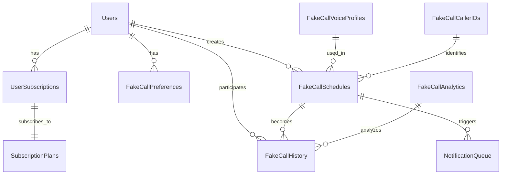

# Fake Call Notification System - Database Schema & Data Models

## Overview

This document defines the database schema and data models for the Fake Call Notification System, extending the existing OffScreen Buddy database architecture with Pro tier-specific tables and relationships.

## Database Schema Design Principles

### Core Principles
- **Extensibility**: Designed to accommodate future enhancements
- **Performance**: Optimized for mobile app usage patterns
- **Privacy**: Minimal data collection with local-first approach
- **Scalability**: Support for high-volume Pro tier users
- **Security**: Pro tier feature validation and access control

### Data Architecture Patterns
- **Local-First**: Core functionality works offline
- **Incremental Sync**: Progressive data synchronization
- **Event Sourcing**: Call lifecycle events for analytics
- **Soft Deletes**: User control over data retention
- **Audit Trails**: Complete activity logging for security

## Core Entity Relationships



## Database Tables

### 1. User Subscriptions Management

#### `user_subscriptions` table
Manages Pro tier subscription status and validation

```sql
CREATE TABLE user_subscriptions (
    id UUID PRIMARY KEY DEFAULT gen_random_uuid(),
    user_id UUID NOT NULL REFERENCES users(id) ON DELETE CASCADE,
    subscription_tier VARCHAR(50) NOT NULL DEFAULT 'free',
    status VARCHAR(20) NOT NULL DEFAULT 'active',
    payment_provider VARCHAR(50),
    provider_subscription_id VARCHAR(255),
    
    -- Subscription Details
    plan_name VARCHAR(100),
    billing_cycle VARCHAR(20) DEFAULT 'monthly',
    amount_cents INTEGER,
    currency VARCHAR(3) DEFAULT 'USD',
    
    -- Timing
    started_at TIMESTAMP WITH TIME ZONE DEFAULT NOW(),
    expires_at TIMESTAMP WITH TIME ZONE,
    trial_ends_at TIMESTAMP WITH TIME ZONE,
    last_renewal_at TIMESTAMP WITH TIME ZONE,
    
    -- Status Flags
    auto_renew BOOLEAN DEFAULT false,
    grace_period_until TIMESTAMP WITH TIME ZONE,
    cancellation_requested_at TIMESTAMP WITH TIME ZONE,
    cancelled_at TIMESTAMP WITH TIME ZONE,
    
    -- Metadata
    created_at TIMESTAMP WITH TIME ZONE DEFAULT NOW(),
    updated_at TIMESTAMP WITH TIME ZONE DEFAULT NOW(),
    
    CONSTRAINT valid_tier CHECK (subscription_tier IN ('free', 'pro', 'enterprise')),
    CONSTRAINT valid_status CHECK (status IN ('active', 'cancelled', 'expired', 'trial', 'grace_period'))
);

CREATE INDEX idx_user_subscriptions_user_id ON user_subscriptions(user_id);
CREATE INDEX idx_user_subscriptions_status ON user_subscriptions(status);
CREATE INDEX idx_user_subscriptions_active ON user_subscriptions(user_id, status) 
WHERE status IN ('active', 'trial', 'grace_period');
```

#### `subscription_plans` table
Master table of available subscription plans

```sql
CREATE TABLE subscription_plans (
    id UUID PRIMARY KEY DEFAULT gen_random_uuid(),
    plan_code VARCHAR(50) UNIQUE NOT NULL,
    name VARCHAR(100) NOT NULL,
    description TEXT,
    
    -- Plan Details
    tier VARCHAR(50) NOT NULL,
    price_cents INTEGER NOT NULL,
    currency VARCHAR(3) DEFAULT 'USD',
    billing_cycle VARCHAR(20) NOT NULL,
    
    -- Features
    fake_call_calls_per_month INTEGER DEFAULT 0,
    fake_call_voice_profiles_access INTEGER DEFAULT 0,
    fake_call_advanced_features BOOLEAN DEFAULT false,
    
    -- Limits
    daily_call_limit INTEGER DEFAULT 5,
    monthly_call_limit INTEGER DEFAULT 100,
    max_call_duration_seconds INTEGER DEFAULT 300,
    
    -- Status
    is_active BOOLEAN DEFAULT true,
    is_featured BOOLEAN DEFAULT false,
    
    -- Metadata
    created_at TIMESTAMP WITH TIME ZONE DEFAULT NOW(),
    updated_at TIMESTAMP WITH TIME ZONE DEFAULT NOW()
);
```

### 2. Fake Call Configuration

#### `fake_call_preferences` table
User-specific fake call settings and preferences

```sql
CREATE TABLE fake_call_preferences (
    id UUID PRIMARY KEY DEFAULT gen_random_uuid(),
    user_id UUID NOT NULL REFERENCES users(id) ON DELETE CASCADE,
    
    -- General Settings
    is_enabled BOOLEAN DEFAULT true,
    auto_answer BOOLEAN DEFAULT false,
    default_call_duration_seconds INTEGER DEFAULT 30,
    default_priority VARCHAR(20) DEFAULT 'normal',
    
    -- Voice Settings
    default_voice_profile_id UUID REFERENCES fake_call_voice_profiles(id),
    voice_speed VARCHAR(20) DEFAULT 'normal',
    voice_volume DECIMAL(3,2) DEFAULT 0.7,
    audio_quality VARCHAR(20) DEFAULT 'medium',
    
    -- Caller ID Settings
    preferred_caller_types TEXT[] DEFAULT ARRAY['safe', 'business'],
    allow_business_calls BOOLEAN DEFAULT true,
    allow_emergency_calls BOOLEAN DEFAULT false,
    use_realistic_numbers BOOLEAN DEFAULT true,
    
    -- Scheduling Settings
    smart_scheduling_enabled BOOLEAN DEFAULT true,
    respect_focus_mode BOOLEAN DEFAULT true,
    respect_meetings BOOLEAN DEFAULT true,
    respect_do_not_disturb BOOLEAN DEFAULT true,
    
    -- Notification Settings
    advance_warning_minutes INTEGER DEFAULT 5,
    reminder_enabled BOOLEAN DEFAULT true,
    sound_enabled BOOLEAN DEFAULT true,
    haptic_enabled BOOLEAN DEFAULT true,
    
    -- Accessibility
    screen_reader_enabled BOOLEAN DEFAULT false,
    high_contrast_mode BOOLEAN DEFAULT false,
    large_text_mode BOOLEAN DEFAULT false,
    voice_control_enabled BOOLEAN DEFAULT false,
    simplified_interface BOOLEAN DEFAULT false,
    
    -- Privacy Settings
    log_call_history BOOLEAN DEFAULT true,
    share_analytics BOOLEAN DEFAULT false,
    enable_emergency_override BOOLEAN DEFAULT false,
    
    -- Timestamps
    created_at TIMESTAMP WITH TIME ZONE DEFAULT NOW(),
    updated_at TIMESTAMP WITH TIME ZONE DEFAULT NOW()
);

CREATE UNIQUE INDEX idx_fake_call_preferences_user_id ON fake_call_preferences(user_id);
```

#### `fake_call_voice_profiles` table
Available voice synthesis profiles

```sql
CREATE TABLE fake_call_voice_profiles (
    id UUID PRIMARY KEY DEFAULT gen_random_uuid(),
    
    -- Voice Identity
    name VARCHAR(100) NOT NULL,
    display_name VARCHAR(100) NOT NULL,
    description TEXT,
    
    -- Voice Characteristics
    language_code VARCHAR(5) NOT NULL,
    region VARCHAR(50),
    gender VARCHAR(20),
    age_range VARCHAR(20),
    accent VARCHAR(50),
    personality VARCHAR(50),
    
    -- Quality Settings
    quality_level VARCHAR(20) DEFAULT 'standard',
    file_size_bytes INTEGER,
    sample_rate_hz INTEGER DEFAULT 22050,
    channels INTEGER DEFAULT 1,
    bit_rate_kbps INTEGER DEFAULT 64,
    
    -- Sample Data
    sample_text TEXT,
    sample_audio_url TEXT,
    
    -- Metadata
    is_premium BOOLEAN DEFAULT false,
    is_local BOOLEAN DEFAULT false,
    download_required BOOLEAN DEFAULT false,
    download_size_bytes INTEGER,
    
    -- Status
    is_active BOOLEAN DEFAULT true,
    created_at TIMESTAMP WITH TIME ZONE DEFAULT NOW(),
    updated_at TIMESTAMP WITH TIME ZONE DEFAULT NOW()
);

CREATE INDEX idx_fake_call_voice_profiles_language ON fake_call_voice_profiles(language_code);
CREATE INDEX idx_fake_call_voice_profiles_gender ON fake_call_voice_profiles(gender);
```

### 3. Call Scheduling and Management

#### `fake_call_schedules` table
Scheduled fake calls with configuration

```sql
CREATE TABLE fake_call_schedules (
    id UUID PRIMARY KEY DEFAULT gen_random_uuid(),
    user_id UUID NOT NULL REFERENCES users(id) ON DELETE CASCADE,
    
    -- Call Configuration
    caller_id_id UUID REFERENCES fake_call_caller_ids(id),
    voice_profile_id UUID REFERENCES fake_call_voice_profiles(id),
    call_type VARCHAR(20) NOT NULL DEFAULT 'incoming',
    priority VARCHAR(20) NOT NULL DEFAULT 'normal',
    
    -- Scheduling
    scheduled_for TIMESTAMP WITH TIME ZONE NOT NULL,
    timezone VARCHAR(50) DEFAULT 'UTC',
    is_recurring BOOLEAN DEFAULT false,
    recurrence_pattern JSONB,
    
    -- Call Parameters
    call_duration_seconds INTEGER DEFAULT 30,
    auto_answer BOOLEAN DEFAULT false,
    audio_message TEXT,
    custom_ringtone VARCHAR(255),
    vibrate_pattern INTEGER[],
    background_image_url TEXT,
    emergency_override BOOLEAN DEFAULT false,
    
    -- Smart Scheduling
    smart_scheduling_enabled BOOLEAN DEFAULT true,
    skip_during_focus BOOLEAN DEFAULT true,
    skip_during_meetings BOOLEAN DEFAULT true,
    respect_do_not_disturb BOOLEAN DEFAULT true,
    context_aware BOOLEAN DEFAULT false,
    
    -- Notification Settings
    advance_warning_minutes INTEGER DEFAULT 5,
    reminder_enabled BOOLEAN DEFAULT true,
    reminder_message TEXT,
    
    -- Status
    status VARCHAR(20) DEFAULT 'scheduled',
    executed_at TIMESTAMP WITH TIME ZONE,
    created_at TIMESTAMP WITH TIME ZONE DEFAULT NOW(),
    updated_at TIMESTAMP WITH TIME ZONE DEFAULT NOW(),
    
    CONSTRAINT valid_call_type CHECK (call_type IN ('incoming', 'outgoing', 'scheduled', 'emergency')),
    CONSTRAINT valid_priority CHECK (priority IN ('low', 'normal', 'high', 'urgent')),
    CONSTRAINT valid_status CHECK (status IN ('scheduled', 'triggered', 'cancelled', 'failed', 'completed'))
);

CREATE INDEX idx_fake_call_schedules_user_id ON fake_call_schedules(user_id);
CREATE INDEX idx_fake_call_schedules_scheduled_for ON fake_call_schedules(scheduled_for);
CREATE INDEX idx_fake_call_schedules_status ON fake_call_schedules(status);
```

#### `fake_call_history` table
Complete call lifecycle and interaction history

```sql
CREATE TABLE fake_call_history (
    id UUID PRIMARY KEY DEFAULT gen_random_uuid(),
    user_id UUID NOT NULL REFERENCES users(id) ON DELETE CASCADE,
    schedule_id UUID REFERENCES fake_call_schedules(id),
    
    -- Call Identity
    call_id VARCHAR(255) UNIQUE NOT NULL,
    session_id VARCHAR(255),
    
    -- Call State
    initial_state VARCHAR(20) NOT NULL,
    final_state VARCHAR(20) NOT NULL,
    call_type VARCHAR(20) NOT NULL,
    priority VARCHAR(20) NOT NULL,
    
    -- Timing
    scheduled_for TIMESTAMP WITH TIME ZONE,
    started_at TIMESTAMP WITH TIME ZONE,
    answered_at TIMESTAMP WITH TIME ZONE,
    ended_at TIMESTAMP WITH TIME ZONE,
    duration_seconds INTEGER,
    
    -- Interaction Tracking
    user_interactions JSONB DEFAULT '[]',
    
    -- Voice and Audio
    voice_profile_id UUID REFERENCES fake_call_voice_profiles(id),
    synthesis_latency_ms INTEGER,
    audio_quality VARCHAR(20),
    
    -- Platform Information
    platform VARCHAR(20) NOT NULL,
    platform_version VARCHAR(50),
    device_model VARCHAR(100),
    call_kit_used BOOLEAN DEFAULT false,
    
    -- Performance Metrics
    startup_time_ms INTEGER,
    memory_usage_mb DECIMAL(8,2),
    battery_impact_score DECIMAL(3,2),
    
    -- Success Metrics
    call_successful BOOLEAN DEFAULT false,
    user_satisfaction_score INTEGER,
    
    -- Metadata
    created_at TIMESTAMP WITH TIME ZONE DEFAULT NOW(),
    
    CONSTRAINT valid_initial_state CHECK (initial_state IN ('scheduled', 'incoming', 'failed')),
    CONSTRAINT valid_final_state CHECK (final_state IN ('active', 'connected', 'ended', 'dismissed', 'failed'))
);

CREATE INDEX idx_fake_call_history_user_id ON fake_call_history(user_id);
CREATE INDEX idx_fake_call_history_scheduled_for ON fake_call_history(scheduled_for);
CREATE INDEX idx_fake_call_history_platform ON fake_call_history(platform);
```

### 4. Analytics and Security

#### `fake_call_analytics` table
Aggregated analytics data for Pro tier insights

```sql
CREATE TABLE fake_call_analytics (
    id UUID PRIMARY KEY DEFAULT gen_random_uuid(),
    user_id UUID NOT NULL REFERENCES users(id) ON DELETE CASCADE,
    
    -- Time Period
    period_type VARCHAR(20) NOT NULL,
    period_start TIMESTAMP WITH TIME ZONE NOT NULL,
    period_end TIMESTAMP WITH TIME ZONE NOT NULL,
    
    -- Usage Metrics
    total_calls INTEGER DEFAULT 0,
    successful_calls INTEGER DEFAULT 0,
    failed_calls INTEGER DEFAULT 0,
    average_duration_seconds DECIMAL(8,2) DEFAULT 0,
    
    -- Engagement Metrics
    answer_rate DECIMAL(5,4) DEFAULT 0,
    completion_rate DECIMAL(5,4) DEFAULT 0,
    user_satisfaction_avg DECIMAL(3,2) DEFAULT 0,
    
    -- Feature Usage
    most_used_voice_profiles JSONB DEFAULT '[]',
    most_common_caller_types JSONB DEFAULT '[]',
    
    -- Performance Metrics
    avg_startup_time_ms INTEGER DEFAULT 0,
    reliability_score DECIMAL(3,2) DEFAULT 0,
    
    -- Metadata
    generated_at TIMESTAMP WITH TIME ZONE DEFAULT NOW(),
    created_at TIMESTAMP WITH TIME ZONE DEFAULT NOW(),
    
    CONSTRAINT valid_period_type CHECK (period_type IN ('daily', 'weekly', 'monthly', 'quarterly'))
);

CREATE UNIQUE INDEX idx_fake_call_analytics_user_period ON fake_call_analytics(user_id, period_type, period_start, period_end);
```

#### `fake_call_audit_log` table
Security audit trail for compliance

```sql
CREATE TABLE fake_call_audit_log (
    id UUID PRIMARY KEY DEFAULT gen_random_uuid(),
    user_id UUID REFERENCES users(id),
    
    -- Action Details
    action_type VARCHAR(50) NOT NULL,
    resource_type VARCHAR(50) NOT NULL,
    resource_id VARCHAR(255),
    
    -- Actor Information
    actor_type VARCHAR(20) NOT NULL,
    actor_id VARCHAR(255),
    session_id VARCHAR(255),
    
    -- Security Context
    ip_address INET,
    user_agent TEXT,
    api_endpoint VARCHAR(255),
    
    -- Result
    success BOOLEAN NOT NULL,
    error_code VARCHAR(50),
    error_message TEXT,
    
    -- Security Context
    permission_checked BOOLEAN DEFAULT true,
    subscription_validated BOOLEAN DEFAULT true,
    
    -- Metadata
    created_at TIMESTAMP WITH TIME ZONE DEFAULT NOW()
);

CREATE INDEX idx_fake_call_audit_log_user_id ON fake_call_audit_log(user_id);
CREATE INDEX idx_fake_call_audit_log_timestamp ON fake_call_audit_log(created_at);
```

## Data Migration and Initialization

### Initial Data Setup

```sql
-- Insert subscription plans
INSERT INTO subscription_plans (plan_code, name, tier, price_cents, billing_cycle, fake_call_calls_per_month, fake_call_voice_profiles_access, fake_call_advanced_features) VALUES 
('pro_monthly', 'Pro Monthly', 'pro', 999, 'monthly', 100, 5, true),
('pro_yearly', 'Pro Yearly', 'pro', 9999, 'yearly', 100, 5, true),
('enterprise_monthly', 'Enterprise Monthly', 'enterprise', 2999, 'monthly', 500, 10, true);

-- Insert default voice profiles
INSERT INTO fake_call_voice_profiles (name, display_name, language_code, gender, age_range, personality, quality_level, sample_text) VALUES
('professional_male', 'Professional Male', 'en-US', 'male', 'adult', 'professional', 'premium', 'Hello, this is a professional call.'),
('professional_female', 'Professional Female', 'en-US', 'female', 'adult', 'professional', 'premium', 'Hello, this is a professional call.'),
('casual_male', 'Casual Male', 'en-US', 'male', 'adult', 'casual', 'standard', 'Hey, hope you are doing well.'),
('casual_female', 'Casual Female', 'en-US', 'female', 'adult', 'casual', 'standard', 'Hey, hope you are doing well.');

-- Insert safe caller IDs
INSERT INTO fake_call_caller_ids (name, phone_number, caller_type, risk_level, is_verified) VALUES
('ABC Solutions', '+1-555-0101', 'business', 'low', true),
('Tech Support', '+1-555-0102', 'safe', 'low', true),
('Emergency Services', '911', 'emergency', 'low', true),
('Dr. Sarah Johnson', '+1-555-0103', 'safe', 'low', true);
```

## Performance and Security Considerations

### Row Level Security (RLS)

```sql
-- Enable RLS on sensitive tables
ALTER TABLE fake_call_preferences ENABLE ROW LEVEL SECURITY;
ALTER TABLE fake_call_schedules ENABLE ROW LEVEL SECURITY;
ALTER TABLE fake_call_history ENABLE ROW LEVEL SECURITY;

-- Policies for user data access
CREATE POLICY "Users can access own preferences" ON fake_call_preferences
    FOR ALL USING (user_id = current_setting('app.current_user_id')::UUID);

CREATE POLICY "Users can access own schedules" ON fake_call_schedules
    FOR ALL USING (user_id = current_setting('app.current_user_id')::UUID);
```

### Data Retention

```sql
-- Cleanup function for old data
CREATE OR REPLACE FUNCTION cleanup_fake_call_data()
RETURNS void AS $$
BEGIN
    -- Delete completed calls older than 90 days
    DELETE FROM fake_call_history 
    WHERE ended_at < NOW() - INTERVAL '90 days' 
    AND final_state IN ('ended', 'dismissed');
    
    -- Delete old audit logs (1 year retention)
    DELETE FROM fake_call_audit_log 
    WHERE created_at < NOW() - INTERVAL '1 year';
    
    -- Clean up analytics older than 2 years
    DELETE FROM fake_call_analytics 
    WHERE generated_at < NOW() - INTERVAL '2 years';
END;
$$ LANGUAGE plpgsql;
```

This comprehensive database schema provides a robust foundation for the Fake Call Notification System while maintaining performance, security, and compliance with privacy regulations.