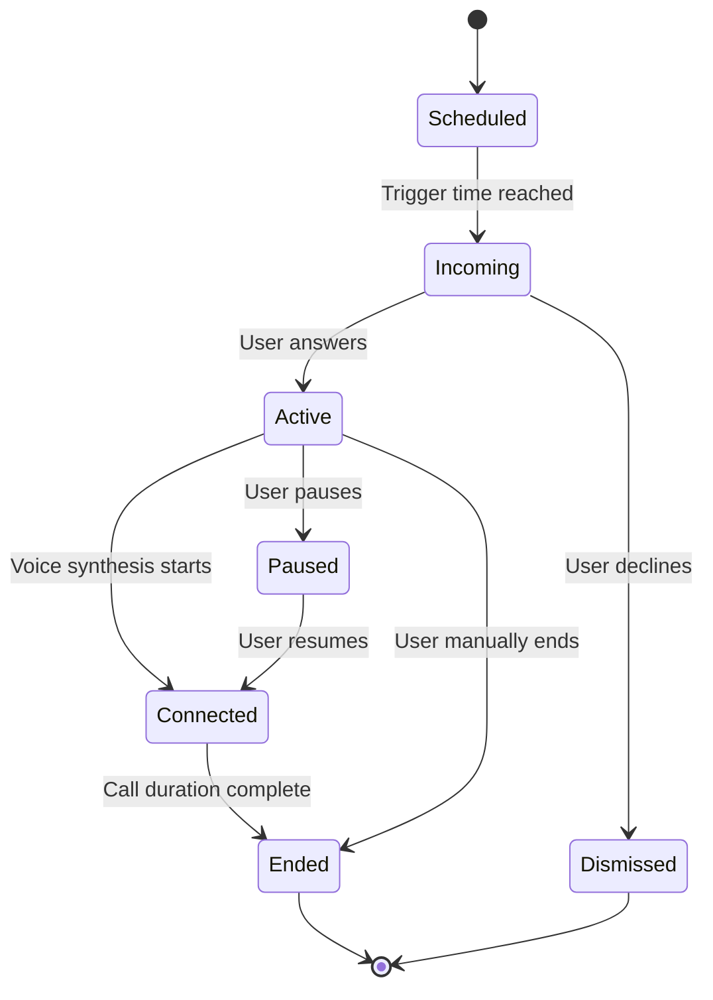
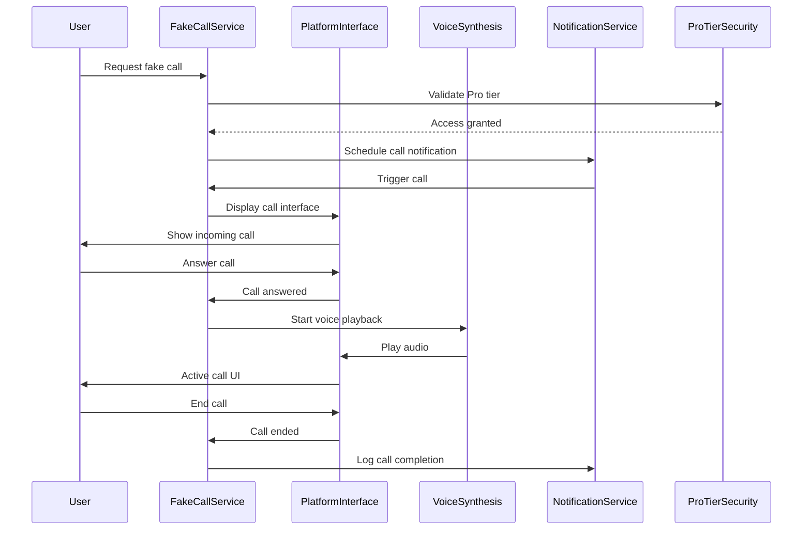
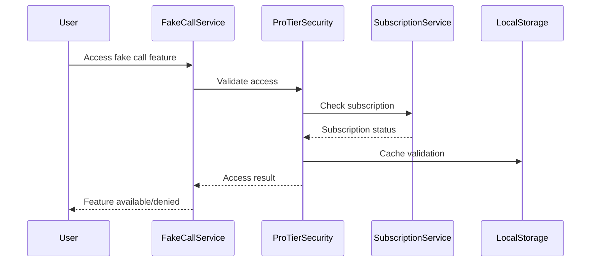
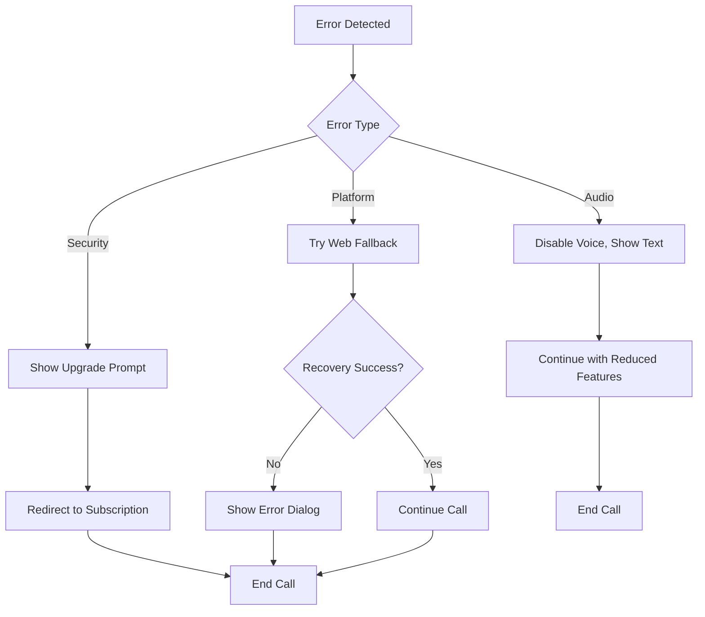

# Fake Call Notification System Architecture
## OffScreen Buddy Pro Tier - Technical Specification

### Executive Summary

This document outlines the technical architecture for the Fake Call Notification System, a Pro-tier feature that extends the existing notification infrastructure to provide realistic call simulation capabilities. The system leverages platform-specific APIs, voice synthesis, and intelligent scheduling to create authentic call experiences while maintaining strict safety and privacy standards.

## Table of Contents

1. [System Overview](#system-overview)
2. [Architecture Components](#architecture-components)
3. [Data Flow and Lifecycle](#data-flow-and-lifecycle)
4. [Platform-Specific Integrations](#platform-specific-integrations)
5. [Voice Synthesis and Audio](#voice-synthesis-and-audio)
6. [Security and Privacy](#security-and-privacy)
7. [User Interface Design](#user-interface-design)
8. [Performance Optimization](#performance-optimization)
9. [Error Handling](#error-handling)
10. [Testing Strategy](#testing-strategy)

## System Overview

### Core Objectives

- **Seamless Integration**: Extend existing notification system without disrupting current functionality
- **Platform Authenticity**: Utilize native APIs where possible (iOS CallKit, Android Phone)
- **Safety First**: Ensure all caller IDs are safe and non-misleading
- **Pro Tier Validation**: Strict subscription-based access control
- **Accessibility Compliance**: Full WCAG 2.1 AA compliance
- **Performance Optimized**: Minimal battery and resource impact

### System Boundaries

- **In Scope**: Call simulation, voice synthesis, caller ID management, Pro tier features
- **Out of Scope**: Real calling functionality, actual phone integration, emergency services

## Architecture Components

### 1. Core Services

#### FakeCallService
```typescript
class FakeCallService {
  // Main orchestrator for fake call functionality
  private callStateManager: CallStateManager;
  private voiceSynthesis: VoiceSynthesisService;
  private callerIDGenerator: CallerIDGenerator;
  private proTierSecurity: ProTierSecurity;
  
  async initiateCall(config: FakeCallConfig): Promise<CallResult>;
  async endCall(callId: string): Promise<void>;
  async scheduleCall(schedule: CallSchedule): Promise<SchedulingResult>;
}
```

#### CallStateManager
```typescript
class CallStateManager {
  // Manages call lifecycle and state transitions
  private currentCalls: Map<string, CallState>;
  
  handleUserInteraction(callId: string, action: CallAction): Promise<void>;
  autoDisconnectOnTimeout(callId: string): Promise<void>;
  pauseCall(callId: string): Promise<void>;
  resumeCall(callId: string): Promise<void>;
}
```

### 2. Platform Integration Layer

#### PlatformCallInterface
```typescript
interface PlatformCallInterface {
  // Unified interface for platform-specific call simulation
  
  // iOS Implementation
  initializeCallKit(): Promise<void>;
  displayIncomingCall(callerInfo: CallerInfo): Promise<void>;
  dismissCallInterface(): Promise<void>;
  
  // Android Implementation
  startPhoneSimulation(): Promise<void>;
  showCallScreen(callerInfo: CallerInfo): Promise<void>;
  
  // Web Implementation
  renderWebCallUI(callerInfo: CallerInfo): void;
  closeWebCallUI(): void;
}
```

### 3. Voice and Audio System

#### VoiceSynthesisService
```typescript
class VoiceSynthesisService {
  // Handles realistic voice generation for calls
  private textToSpeech: TTSEngine;
  private audioManager: CallAudioManager;
  private voiceProfiles: VoiceProfile[];
  
  async synthesizeSpeech(text: string, voiceId: string): Promise<AudioBuffer>;
  async playCallVoice(audioData: AudioBuffer): Promise<void>;
  getAvailableVoices(): VoiceProfile[];
}
```

### 4. Security and Safety

#### ProTierSecurity
```typescript
class ProTierSecurity {
  // Validates Pro tier access and manages subscription status
  private subscriptionValidator: SubscriptionValidator;
  
  async validateProTierAccess(userId: string): Promise<boolean>;
  async getSubscriptionStatus(userId: string): Promise<SubscriptionStatus>;
  async logFeatureUsage(userId: string, feature: string): Promise<void>;
}
```

#### CallerIDGenerator
```typescript
class CallerIDGenerator {
  // Generates safe, realistic caller IDs
  private nameDatabase: SafeNameDatabase;
  private phoneNumberGenerator: PhoneNumberGenerator;
  
  generateSafeCallerID(): Promise<CallerInfo>;
  validateCallerIDSafety(callerInfo: CallerInfo): boolean;
  getRandomSafeName(): string;
}
```

## Data Flow and Lifecycle

### Call Lifecycle States



### Data Flow Diagram



## Platform-Specific Integrations

### iOS Implementation

#### CallKit Integration
- **Provider Extension**: Use CXProvider for call interface
- **Call Controller**: CXCallController for call management
- **Actions**: Answer, decline, end call actions
- **Audio**: AVAudioSession for call audio

#### Key Features
```swift
class CallKitManager: NSObject, CXProviderDelegate {
    private let callController = CXCallController()
    private let provider: CXProvider
    
    func reportIncomingCall(callUUID: UUID, handle: String) {
        let callUpdate = CXCallUpdate()
        callUpdate.remoteHandle = CXHandle(type: .phoneNumber, value: handle)
        callUpdate.supportsDTMF = true
        callUpdate.hasConnected = false
        callUpdate.hasEnded = true
        
        provider.reportNewIncomingCall(with: callUUID, update: callUpdate, completion: { _ in })
    }
}
```

### Android Implementation

#### Phone Simulation
- **InCallService**: Simulate incoming call UI
- **TelecomManager**: Manage call state
- **Notification**: High-priority incoming call notification

#### Key Implementation
```kotlin
class CallSimulationService : InCallService() {
    override fun onCallAdded(call: Call) {
        if (call.state == Call.STATE_ACTIVE) {
            showFakeCallUI(call)
        }
    }
    
    private fun showFakeCallUI(call: Call) {
        val notification = buildCallNotification()
        startForeground(CALL_NOTIFICATION_ID, notification)
    }
}
```

### Web Implementation

#### Custom Call Interface
- **Modal Overlay**: Full-screen call interface
- **Audio Playback**: Web Audio API for voice synthesis
- **Responsive Design**: Mobile-first approach

## Voice Synthesis and Audio

### Audio Architecture

```typescript
interface CallAudioConfig {
  sampleRate: number;
  channels: number;
  bitDepth: number;
  bufferSize: number;
  voiceProfile: VoiceProfile;
}

interface VoiceProfile {
  id: string;
  name: string;
  language: string;
  gender: 'male' | 'female' | 'neutral';
  ageRange: string;
  accent: string;
  quality: 'premium' | 'standard' | 'basic';
}
```

### Audio Processing Pipeline

1. **Text Preprocessing**
   - Clean and normalize text
   - Add natural pauses
   - Handle abbreviations and numbers

2. **Voice Synthesis**
   - Select appropriate voice profile
   - Apply voice characteristics
   - Generate audio buffer

3. **Audio Enhancement**
   - Apply phone-like filters
   - Add background noise
   - Simulate phone compression

4. **Playback Management**
   - Buffer management
   - Error handling
   - Quality monitoring

### Audio Effects

```typescript
const callAudioEffects = {
  // Phone line simulation
  phoneFilter: {
    type: 'bandpass',
    low: 300,    // Hz
    high: 3400   // Hz
  },
  
  // Background noise
  backgroundNoise: {
    type: 'white',
    amplitude: 0.02,
    enabled: true
  },
  
  // Compression
  compression: {
    ratio: 4:1,
    threshold: -20,
    attack: 3,
    release: 100
  }
};
```

## Security and Privacy

### Pro Tier Validation

#### Subscription Status Flow


### Data Protection

#### Privacy Principles
- **Minimal Data Collection**: Only essential user preferences
- **Local Processing**: Voice synthesis runs locally
- **No Call Recording**: No audio recording or storage
- **Secure Storage**: Encrypted user preferences

#### Safety Measures
- **Caller ID Validation**: All generated IDs are safe
- **No Real Numbers**: Never use actual phone numbers
- **Emergency Blocking**: Block emergency service numbers
- **User Reporting**: Allow users to report inappropriate content

### Privacy Policy Compliance

```typescript
interface PrivacyCompliance {
  dataCollection: {
    userPreferences: 'essential-only';
    callHistory: 'local-only';
    subscriptionData: 'secure-server';
  };
  
  dataRetention: {
    preferences: 'user-controlled';
    callLogs: 'session-only';
    analytics: 'anonymized';
  };
  
  userRights: {
    dataAccess: true;
    dataDeletion: true;
    portability: true;
    optOut: true;
  };
}
```

## User Interface Design

### Design System Integration

#### Theme Tokens Extension
```typescript
interface FakeCallThemeTokens {
  colors: {
    callInterface: {
      background: string;
      primaryText: string;
      secondaryText: string;
      acceptButton: string;
      declineButton: string;
      callerName: string;
      callerNumber: string;
    };
    callState: {
      active: string;
      incoming: string;
      ended: string;
      missed: string;
    };
  };
  
  typography: {
    callerName: TypographyTokens;
    callerNumber: TypographyTokens;
    callStatus: TypographyTokens;
  };
  
  animation: {
    callRinging: AnimationConfig;
    buttonPress: AnimationConfig;
    statusChange: AnimationConfig;
  };
}
```

#### Component Architecture
```typescript
// Core Call Interface Components
interface CallInterfaceComponents {
  CallScreen: {
    props: CallScreenProps;
    states: CallState[];
    actions: CallAction[];
  };
  
  CallerInfo: {
    display: CallerDisplay;
    validation: SafetyCheck;
  };
  
  CallControls: {
    answer: ControlButton;
    decline: ControlButton;
    mute: ControlButton;
    speaker: ControlButton;
  };
}
```

### Accessibility Implementation

#### WCAG 2.1 AA Compliance

```typescript
interface AccessibilityFeatures {
  screenReader: {
    announcement: 'call-incoming' | 'call-active' | 'call-ended';
    navigation: 'voice-commands' | 'gesture-navigation';
    feedback: 'audio' | 'haptic' | 'visual';
  };
  
  visual: {
    highContrast: boolean;
    largeText: boolean;
    colorBlindnessSupport: boolean;
    reduceMotion: boolean;
  };
  
  motor: {
    voiceControl: boolean;
    switchControl: boolean;
    gestureAlternatives: boolean;
  };
  
  cognitive: {
    simplifiedInterface: boolean;
    clearInstructions: boolean;
    errorPrevention: boolean;
  };
}
```

## Performance Optimization

### Resource Management

#### Memory Management
- **Audio Buffers**: Efficient buffer pooling
- **Voice Cache**: Smart voice profile caching
- **Cleanup**: Automatic resource cleanup

#### Battery Optimization
- **CPU Throttling**: Reduce processing during idle
- **Audio Processing**: Hardware-accelerated when possible
- **Background Limits**: Respect platform background limits

```typescript
interface PerformanceConfig {
  audio: {
    bufferSize: number;
    sampleRate: number;
    hardwareAcceleration: boolean;
  };
  
  processing: {
    voiceSynthesis: 'async' | 'sync';
    callerIdGeneration: 'cache' | 'generate';
    backgroundProcessing: boolean;
  };
  
  battery: {
    lowPowerMode: boolean;
    cpuThrottling: boolean;
    backgroundLimits: PlatformLimits;
  };
}
```

### Caching Strategy

#### Multi-Level Caching
1. **Memory Cache**: Active call data
2. **Disk Cache**: Voice profiles, user preferences
3. **Network Cache**: Subscription status, updates

#### Cache Invalidation
```typescript
interface CacheStrategy {
  memory: {
    ttl: 300; // 5 minutes
    maxSize: '50MB';
    eviction: 'LRU';
  };
  
  disk: {
    ttl: 3600; // 1 hour
    maxSize: '200MB';
    encryption: true;
  };
  
  network: {
    ttl: 86400; // 24 hours
    validation: 'Etag';
  };
}
```

## Error Handling

### Error Categories

#### System Errors
```typescript
enum FakeCallErrorType {
  // Platform integration errors
  PLATFORM_UNSUPPORTED = 'PLATFORM_UNSUPPORTED',
  CALLKIT_NOT_AVAILABLE = 'CALLKIT_NOT_AVAILABLE',
  AUDIO_SESSION_ERROR = 'AUDIO_SESSION_ERROR',
  
  // Voice synthesis errors
  VOICE_SYNTHESIS_FAILED = 'VOICE_SYNTHESIS_FAILED',
  AUDIO_PLAYBACK_ERROR = 'AUDIO_PLAYBACK_ERROR',
  VOICE_PROFILE_MISSING = 'VOICE_PROFILE_MISSING',
  
  // Security errors
  PRO_TIER_REQUIRED = 'PRO_TIER_REQUIRED',
  SUBSCRIPTION_EXPIRED = 'SUBSCRIPTION_EXPIRED',
  ACCESS_DENIED = 'ACCESS_DENIED',
  
  // General errors
  UNKNOWN_ERROR = 'UNKNOWN_ERROR',
  RESOURCE_EXHAUSTED = 'RESOURCE_EXHAUSTED',
  TIMEOUT_ERROR = 'TIMEOUT_ERROR',
}
```

### Error Recovery Strategies

#### Graceful Degradation
1. **Platform Fallbacks**: Web UI if native not available
2. **Feature Reduction**: Disable audio if synthesis fails
3. **User Notification**: Clear error messaging

#### Recovery Flows


## Testing Strategy

### Test Coverage Matrix

#### Unit Tests
- **Service Layer**: 90% coverage target
- **Utility Functions**: 100% coverage
- **Data Models**: 100% coverage
- **Error Handling**: 95% coverage

#### Integration Tests
- **Platform APIs**: Mock CallKit, Android services
- **Audio Pipeline**: Voice synthesis integration
- **Notification System**: Fake call notifications
- **Pro Tier Security**: Subscription validation

#### End-to-End Tests
- **Complete Call Flow**: From scheduling to completion
- **Cross-Platform**: iOS, Android, Web consistency
- **Accessibility**: Screen reader, keyboard navigation
- **Performance**: Battery, memory, responsiveness

### Test Implementation

#### Mock Services
```typescript
// Mock Platform Interface
class MockPlatformCallInterface implements PlatformCallInterface {
  async initializeCallKit(): Promise<void> {
    // Mock CallKit initialization
  }
  
  async displayIncomingCall(callerInfo: CallerInfo): Promise<void> {
    // Mock incoming call display
  }
}

// Mock Voice Synthesis
class MockVoiceSynthesisService implements VoiceSynthesisService {
  async synthesizeSpeech(text: string, voiceId: string): Promise<AudioBuffer> {
    // Return mock audio buffer
  }
}
```

#### Test Data
```typescript
interface TestCallScenarios {
  successfulCall: {
    callerID: CallerInfo;
    callDuration: number;
    userActions: CallAction[];
  };
  
  failedCall: {
    errorType: FakeCallErrorType;
    expectedBehavior: string;
  };
  
  edgeCases: {
    rapidUserInteractions: CallAction[];
    systemInterruption: boolean;
    networkIssues: boolean;
  };
}
```

## Implementation Roadmap

### Phase 1: Core Infrastructure (Weeks 1-2)
- [ ] Extend notification system types
- [ ] Implement Pro tier security validation
- [ ] Create base FakeCallService
- [ ] Design caller ID generator

### Phase 2: Platform Integration (Weeks 3-4)
- [ ] iOS CallKit implementation
- [ ] Android phone simulation
- [ ] Web call interface
- [ ] Cross-platform testing

### Phase 3: Voice and Audio (Weeks 5-6)
- [ ] Voice synthesis integration
- [ ] Audio pipeline development
- [ ] Call audio effects
- [ ] Audio testing and optimization

### Phase 4: UI/UX and Accessibility (Weeks 7-8)
- [ ] Call interface design
- [ ] Accessibility implementation
- [ ] Theme integration
- [ ] User experience testing

### Phase 5: Testing and Polish (Weeks 9-10)
- [ ] Comprehensive testing
- [ ] Performance optimization
- [ ] Security audit
- [ ] Documentation completion

## Conclusion

The Fake Call Notification System architecture provides a robust, scalable, and secure foundation for this Pro-tier feature. By extending the existing notification infrastructure and leveraging platform-specific capabilities, the system delivers authentic call experiences while maintaining strict safety and privacy standards.

The modular architecture ensures maintainability and enables future enhancements, while the comprehensive testing strategy guarantees reliability across all supported platforms.