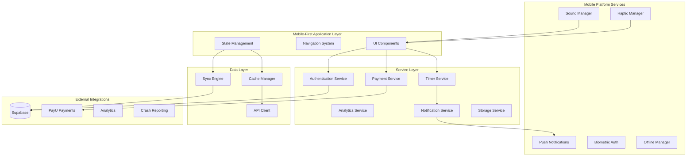

# OffScreen Buddy - Mobile-First Architecture Design

## Executive Summary

This document outlines the comprehensive mobile-first architecture for transforming the current Expo/React Native application into a scalable, maintainable, and feature-rich native mobile application. The architecture emphasizes modularity, offline-first capabilities, and mobile-optimized user experiences.

## Table of Contents

1. [Current State Analysis](#current-state-analysis)
2. [Architecture Overview](#architecture-overview)
3. [Component Hierarchy Design](#component-hierarchy-design)
4. [Service Layer Architecture](#service-layer-architecture)
5. [Design System & Theming](#design-system--theming)
6. [State Management Strategy](#state-management-strategy)
7. [Mobile-Specific Systems](#mobile-specific-systems)
8. [Performance & Security](#performance--security)
9. [Testing Architecture](#testing-architecture)
10. [Migration Strategy](#migration-strategy)

---

## Current State Analysis

### Strengths Identified
- ✅ **Robust Configuration System**: Environment-specific configs with validation
- ✅ **Comprehensive Offline Support**: Network connectivity, offline state management, sync engine
- ✅ **Mobile-Ready Utilities**: Haptic feedback, sound management, structured logging
- ✅ **Modern Tech Stack**: Expo, React Native, TypeScript, Supabase
- ✅ **Security**: Helmet, CORS, input sanitization, payment security
- ✅ **Backend Infrastructure**: Express.js with performance monitoring

### Gaps Requiring Architecture Enhancement
- ⚠️ **Component Organization**: Mixed feature/basic structure needs modular redesign
- ⚠️ **Service Layer**: Minimal service organization, needs expansion
- ⚠️ **State Management**: Basic contexts need enhancement for complex app state
- ⚠️ **Design System**: Colors defined but lacks comprehensive design tokens
- ⚠️ **Scalability**: Component composition patterns need enhancement
- ⚠️ **Testing**: Mobile-specific testing patterns not established

---

## Architecture Overview

### Core Principles

1. **Mobile-First Design**: Every component optimized for touch interactions
2. **Offline-First Architecture**: Core functionality works without connectivity
3. **Modular Component System**: Feature-based organization with clear boundaries
4. **Performance Optimization**: Optimized for mobile performance constraints
5. **Security by Design**: Built-in security patterns and best practices
6. **Scalability**: Designed for feature growth and team expansion

### High-Level Architecture Diagram



---

## Component Hierarchy Design

### New Mobile-First Folder Structure

```
app/
├── components/
│   ├── ui/                          # Base UI components
│   │   ├── primitives/             # Button, Input, Modal, etc.
│   │   ├── forms/                  # Form components
│   │   ├── feedback/               # Loading, Error, Success states
│   │   └── layout/                 # Container, Stack, Grid
│   ├── features/                   # Feature-specific components
│   │   ├── auth/                   # Authentication components
│   │   ├── timer/                  # Timer functionality
│   │   ├── payment/                # Payment flow components
│   │   ├── settings/               # Settings & preferences
│   │   └── analytics/              # Analytics & reporting
│   ├── integrations/               # Third-party components
│   │   ├── PayU/                   # Payment UI components
│   │   ├── notifications/          # Push notification UI
│   │   └── biometric/              # Biometric authentication
│   └── providers/                  # Context providers
│       ├── ThemeProvider.tsx
│       ├── NotificationProvider.tsx
│       └── OfflineProvider.tsx
├── hooks/                          # Custom React hooks
│   ├── useAuth.ts
│   ├── useTimer.ts
│   ├── usePayment.ts
│   ├── useOffline.ts
│   ├── useNotification.ts
│   └── useBiometric.ts
├── services/                       # Business logic layer
│   ├── auth/                       # Authentication services
│   │   ├── AuthService.ts
│   │   ├── BiometricService.ts
│   │   └── SessionService.ts
│   ├── timer/                      # Timer functionality
│   │   ├── TimerService.ts
│   │   ├── FocusSessionService.ts
│   │   └── TimerAnalyticsService.ts
│   ├── payment/                    # Payment processing
│   │   ├── PaymentService.ts
│   │   ├── PayUService.ts
│   │   └── SubscriptionService.ts
│   ├── storage/                    # Data persistence
│   │   ├── LocalStorageService.ts
│   │   ├── CacheService.ts
│   │   └── SyncService.ts
│   └── platform/                   # Platform-specific services
│       ├── NotificationService.ts
│       ├── HapticService.ts
│       └── SoundService.ts
├── stores/                         # State management (Zustand)
│   ├── authStore.ts
│   ├── timerStore.ts
│   ├── settingsStore.ts
│   └── appStore.ts
├── utils/                          # Utility functions
│   ├── formatters.ts
│   ├── validators.ts
│   ├── deviceInfo.ts
│   └── platformHelpers.ts
├── types/                          # TypeScript definitions
│   ├── api.ts
│   ├── components.ts
│   ├── services.ts
│   └── platform.ts
├── config/                         # Configuration
│   ├── app.config.ts              # App configuration
│   ├── theme.ts                   # Design tokens
│   └── constants.ts               # App constants
└── navigation/                     # Navigation structure
    ├── AppNavigator.tsx
    ├── AuthNavigator.tsx
    ├── TabNavigator.tsx
    └── StackNavigators/
```

### Component Composition Patterns

#### 1. Atomic Design Pattern for UI Components

```typescript
// atoms - Basic building blocks
export interface ButtonProps {
  variant: 'primary' | 'secondary' | 'outline';
  size: 'sm' | 'md' | 'lg';
  onPress: () => void;
  children: React.ReactNode;
  haptic?: boolean; // Mobile-specific property
}

// molecules - Combinations of atoms
export interface TimerButtonProps extends ButtonProps {
  duration: number;
  isActive: boolean;
  onTimerStart: (duration: number) => void;
  onTimerPause: () => void;
  sound?: SoundType;
  haptic?: HapticType;
}

// organisms - Complex UI sections
export interface TimerDisplayProps {
  timeRemaining: number;
  isActive: boolean;
  onStart: () => void;
  onPause: () => void;
  onReset: () => void;
  onComplete: () => void;
  soundEnabled: boolean;
  hapticEnabled: boolean;
}

// templates - Page layouts
export interface TimerScreenTemplateProps {
  timerDisplay: React.ReactNode;
  timerControls: React.ReactNode;
  settingsButton: React.ReactNode;
  progressIndicator: React.ReactNode;
}

// pages - Complete screens
export interface TimerScreenProps extends TimerScreenTemplateProps {
  userId: string;
  sessionId: string;
}
```

#### 2. Feature-Based Component Architecture

```typescript
// Feature container component
export const TimerFeature: React.FC = () => {
  const { state, actions } = useTimerFeature();
  
  return (
    <TimerProvider>
      <TimerScreenTemplate
        timerDisplay={
          <TimerDisplay 
            timeRemaining={state.timeRemaining}
            isActive={state.isActive}
          />
        }
        timerControls={
          <TimerControls
            onStart={actions.start}
            onPause={actions.pause}
            onReset={actions.reset}
            disabled={!state.canStart}
          />
        }
        settingsButton={<SettingsButton onPress={actions.openSettings} />}
      />
    </TimerProvider>
  );
};
```

---

## Service Layer Architecture

### Service Organization Principles

1. **Single Responsibility**: Each service has one clear purpose
2. **Mobile-Optimized**: Services handle mobile-specific constraints
3. **Offline-Aware**: Built-in offline functionality
4. **Testable**: Services designed for easy unit testing
5. **Observable**: Built-in logging and error tracking

### Core Service Architecture

```typescript
// Base service interface
export interface BaseService {
  initialize(): Promise<void>;
  getStatus(): ServiceStatus;
  error: EventEmitter; // Error events
  log: Logger;
}

// Mobile-optimized service interface
export interface MobileService extends BaseService {
  isOnline: boolean;
  getCacheSize(): number;
  clearCache(): Promise<void>;
  sync(): Promise<SyncResult>;
}

// Authentication Service
export class AuthService implements MobileService {
  private sessionManager: SessionManager;
  private biometricAuth: BiometricService;
  private offlineQueue: OfflineQueue;
  
  async login(credentials: LoginCredentials): Promise<AuthResult> {
    try {
      // Handle online authentication
      if (this.isOnline) {
        const result = await this.performOnlineLogin(credentials);
        await this.sessionManager.storeSession(result.session);
        return result;
      }
      
      // Handle offline authentication
      return await this.performOfflineLogin(credentials);
    } catch (error) {
      this.handleAuthError(error);
      throw error;
    }
  }
  
  async enableBiometricAuth(): Promise<boolean> {
    const isAvailable = await this.biometricAuth.isAvailable();
    if (isAvailable) {
      await this.biometricAuth.enroll();
      // Store biometric reference for future use
      await this.storeBiometricReference();
    }
    return isAvailable;
  }
}

// Timer Service with Offline Support
export class TimerService implements MobileService {
  private timerEngine: TimerEngine;
  private notificationManager: NotificationManager;
  private hapticManager: HapticManager;
  private soundManager: SoundManager;
  
  async startTimer(duration: number): Promise<TimerSession> {
    const session = await this.timerEngine.createSession(duration);
    
    // Schedule notifications
    await this.notificationManager.scheduleTimerNotifications(session);
    
    // Start with haptic feedback
    await this.hapticManager.trigger(HapticType.TIMER_START);
    
    // Play start sound if enabled
    await this.soundManager.playTimerSound('start');
    
    return session;
  }
  
  async pauseTimer(sessionId: string): Promise<void> {
    await this.timerEngine.pauseSession(sessionId);
    await this.hapticManager.trigger(HapticType.TIMER_PAUSE);
    
    // Update notification
    await this.notificationManager.updateTimerNotification(sessionId, 'paused');
  }
  
  async completeTimer(sessionId: string): Promise<TimerCompletion> {
    const completion = await this.timerEngine.completeSession(sessionId);
    
    // Trigger completion feedback
    await this.hapticManager.trigger(HapticType.TIMER_COMPLETE);
    await this.soundManager.playCompletionFanfare();
    
    // Update analytics
    await this.analytics.trackTimerCompletion(completion);
    
    // Schedule next reminder if applicable
    await this.notificationManager.scheduleNextReminder(completion);
    
    return completion;
  }
}
```

### Service Communication Pattern

```typescript
// Service registry for dependency injection
export class ServiceRegistry {
  private services = new Map<string, MobileService>();
  
  register<T extends MobileService>(name: string, service: T): void {
    this.services.set(name, service);
    this.setupServiceInterceptors(service);
  }
  
  get<T extends MobileService>(name: string): T {
    return this.services.get(name) as T;
  }
  
  private setupServiceInterceptors(service: MobileService): void {
    // Add common middleware
    service.error.on('error', this.handleServiceError);
    
    // Add offline handling
    service.error.on('offline', this.handleOfflineScenario);
  }
}

// Usage in components
const authService = serviceRegistry.get('auth');
const timerService = serviceRegistry.get('timer');
```

---

## Design System & Theming

### Design Token Architecture

```typescript
// Design tokens for consistent theming
export interface DesignTokens {
  colors: ColorTokens;
  typography: TypographyTokens;
  spacing: SpacingTokens;
  borderRadius: BorderRadiusTokens;
  shadows: ShadowTokens;
  animations: AnimationTokens;
}

// Mobile-optimized color system
export interface ColorTokens {
  // Brand colors
  primary: {
    50: string;   // lightest
    100: string;
    500: string;  // main
    900: string;  // darkest
  };
  
  // Semantic colors for mobile
  success: {
    light: string;
    main: string;
    dark: string;
  };
  
  // Dark mode support
  mode: {
    light: ColorTokens;
    dark: ColorTokens;
  };
  
  // Accessibility colors
  contrast: {
    high: string;
    low: string;
    medium: string;
  };
  
  // System colors
  background: {
    primary: string;
    secondary: string;
    surface: string;
  };
  
  // Feedback colors
  feedback: {
    error: string;
    warning: string;
    info: string;
    success: string;
  };
}
```

### Responsive Design System

```typescript
// Mobile-first responsive breakpoints
export const breakpoints = {
  xs: 0,      // Small phones
  sm: 576,    // Large phones
  md: 768,    // Tablets (portrait)
  lg: 1024,   // Tablets (landscape)
  xl: 1200,   // Desktop
};

// Responsive utilities
export const useResponsive = () => {
  const [dimensions, setDimensions] = useState({
    width: Dimensions.get('window').width,
    height: Dimensions.get('window').height,
  });
  
  const isSmallPhone = dimensions.width < breakpoints.sm;
  const isTablet = dimensions.width >= breakpoints.md && dimensions.width < breakpoints.lg;
  const isLandscape = dimensions.width > dimensions.height;
  
  return {
    dimensions,
    isSmallPhone,
    isTablet,
    isLandscape,
    breakpoint: getBreakpoint(dimensions.width),
  };
};

// Adaptive component props
export interface ResponsiveButtonProps {
  size: ResponsiveValue<'sm' | 'md' | 'lg'>;
  padding: ResponsiveValue<Spacing>;
  fontSize: ResponsiveValue<TypographySize>;
}
```

### Component Variants for Mobile

```typescript
// Touch-optimized button component
export const TouchButton: React.FC<TouchButtonProps> = ({
  variant = 'primary',
  size = 'md',
  haptic = true,
  sound = true,
  onPress,
  children,
  ...props
}) => {
  const { triggerHaptic } = useHaptics();
  const { playSound } = useSound();
  
  const handlePress = async () => {
    // Trigger haptic feedback
    if (haptic) {
      await triggerHaptic('light');
    }
    
    // Play sound
    if (sound) {
      await playSound('button');
    }
    
    // Execute callback
    onPress();
  };
  
  return (
    <Button
      {...props}
      size={getResponsiveSize(size)}
      padding={getTouchPadding()}
      onPress={handlePress}
      activeOpacity={0.8}
      hitSlop={{ top: 10, bottom: 10, left: 10, right: 10 }}
    >
      {children}
    </Button>
  );
};
```

---

## State Management Strategy

### Hybrid State Management Approach

```typescript
// Global app state with Zustand
export interface AppState {
  // Authentication state
  user: User | null;
  session: Session | null;
  isAuthenticated: boolean;
  
  // App configuration
  theme: Theme;
  settings: AppSettings;
  isOnline: boolean;
  
  // Feature states
  timer: TimerState;
  notifications: NotificationState;
  offline: OfflineState;
  
  // Actions
  setUser: (user: User) => void;
  logout: () => void;
  updateSettings: (settings: Partial<AppSettings>) => void;
  setOnlineStatus: (isOnline: boolean) => void;
}

// Feature-specific stores
export const useAuthStore = create<AuthState>((set, get) => ({
  user: null,
  session: null,
  isAuthenticated: false,
  
  login: async (credentials) => {
    const authService = serviceRegistry.get('auth');
    const result = await authService.login(credentials);
    
    set({
      user: result.user,
      session: result.session,
      isAuthenticated: true,
    });
    
    // Sync offline data
    await syncOfflineData();
  },
  
  logout: async () => {
    const authService = serviceRegistry.get('auth');
    await authService.logout();
    
    set({
      user: null,
      session: null,
      isAuthenticated: false,
    });
  },
}));

// Complex state with React Query integration
export const useTimerData = () => {
  const queryClient = useQueryClient();
  
  return {
    // Real-time timer data
    timerSessions: useQuery({
      queryKey: ['timer-sessions'],
      queryFn: timerService.getSessions,
      staleTime: 5 * 60 * 1000, // 5 minutes
    }),
    
    // Mutations for timer actions
    startTimer: useMutation({
      mutationFn: timerService.startTimer,
      onSuccess: () => {
        queryClient.invalidateQueries(['timer-sessions']);
      },
    }),
    
    // Optimistic updates for better UX
    pauseTimer: useMutation({
      mutationFn: ({ sessionId }) => timerService.pauseTimer(sessionId),
      onMutate: async ({ sessionId }) => {
        await queryClient.cancelQueries(['timer-sessions']);
        
        const previousSessions = queryClient.getQueryData(['timer-sessions']);
        
        queryClient.setQueryData(['timer-sessions'], (old) =>
          old?.map((session) =>
            session.id === sessionId
              ? { ...session, status: 'paused' as const }
              : session
          )
        );
        
        return { previousSessions };
      },
      onError: (err, { sessionId }, context) => {
        queryClient.setQueryData(['timer-sessions'], context?.previousSessions);
      },
      onSettled: () => {
        queryClient.invalidateQueries(['timer-sessions']);
      },
    }),
  };
};
```

### State Persistence Strategy

```typescript
// Automatic state persistence
export const persistConfig = {
  name: 'offscreen-buddy-storage',
  storage: AsyncStorage,
  partialize: (state: AppState) => ({
    // Only persist non-sensitive data
    user: state.user ? { id: state.user.id, name: state.user.name } : null,
    theme: state.theme,
    settings: state.settings,
  }),
  migrate: (persistedState: any, version: number) => {
    // Handle state migrations
    if (version < 2) {
      return {
        ...persistedState,
        settings: {
          ...persistedState.settings,
          newFeature: true,
        },
      };
    }
    return persistedState;
  },
};

// Offline state queue
export const useOfflineQueue = () => {
  const [queue, setQueue] = useState<OfflineOperation[]>([]);
  
  const addToQueue = useCallback((operation: OfflineOperation) => {
    setQueue(prev => [...prev, { ...operation, id: generateId() }]);
    
    // Store in AsyncStorage for persistence
    AsyncStorage.setItem('offline-queue', JSON.stringify([...queue, operation]));
  }, [queue]);
  
  const processQueue = useCallback(async () => {
    if (!getNetworkStatus().isConnected) return;
    
    const processedOperations = [];
    
    for (const operation of queue) {
      try {
        await executeOperation(operation);
        processedOperations.push(operation.id);
      } catch (error) {
        console.error('Failed to process offline operation:', error);
        // Handle failure - keep in queue or mark as failed
      }
    }
    
    // Remove processed operations
    setQueue(prev => prev.filter(op => !processedOperations.includes(op.id)));
  }, [queue]);
  
  // Process queue when coming online
  useEffect(() => {
    if (getNetworkStatus().isConnected && queue.length > 0) {
      processQueue();
    }
  }, [getNetworkStatus().isConnected, processQueue, queue.length]);
  
  return { addToQueue, queue, processQueue };
};
```

---

## Mobile-Specific Systems

### Push Notification Architecture

```typescript
// Comprehensive notification service
export class NotificationService {
  private notificationManager: ExpoNotifications.NotificationManager;
  private analytics: AnalyticsService;
  
  async initialize(): Promise<void> {
    // Request permissions
    const permission = await this.notificationManager.requestPermissionsAsync();
    
    if (permission.status === 'granted') {
      // Get push token
      const token = await this.notificationManager.getExpoPushTokenAsync();
      await this.registerPushToken(token.data);
      
      // Setup notification handlers
      this.setupNotificationHandlers();
    }
  }
  
  async scheduleTimerReminder(
    timerId: string,
    title: string,
    message: string,
    triggerTime: Date
  ): Promise<void> {
    await this.notificationManager.scheduleNotificationAsync({
      content: {
        title,
        body: message,
        data: { timerId, type: 'timer_reminder' },
        sound: 'default',
      },
      trigger: triggerTime,
    });
    
    await this.analytics.trackNotificationScheduled('timer_reminder');
  }
  
  async scheduleSmartBreak(
    userId: string,
    breakDuration: number
  ): Promise<void> {
    // AI-powered break scheduling based on user patterns
    const optimalTime = await this.calculateOptimalBreakTime(userId);
    
    await this.notificationManager.scheduleNotificationAsync({
      content: {
        title: 'Time for a break!',
        body: `You've been focused for a while. Take ${breakDuration} minutes to recharge.`,
        data: { type: 'smart_break', breakDuration },
        sound: 'gentle',
      },
      trigger: optimalTime,
    });
  }
  
  private setupNotificationHandlers(): void {
    // Handle notification received while app is open
    this.notificationManager.addNotificationReceivedListener(notification => {
      this.handleNotificationReceived(notification);
    });
    
    // Handle notification response (user tapped)
    this.notificationManager.addNotificationResponseReceivedListener(response => {
      this.handleNotificationResponse(response);
    });
  }
}
```

### Offline-First Data Management

```typescript
// Enhanced offline management system
export class OfflineManager {
  private cacheManager: CacheManager;
  private syncEngine: SyncEngine;
  private conflictResolver: ConflictResolver;
  
  async initialize(): Promise<void> {
    // Load cached data
    await this.cacheManager.initialize();
    
    // Start sync engine
    await this.syncEngine.start();
    
    // Setup conflict resolution
    this.conflictResolver.registerStrategy('timer_session', this.resolveTimerConflict);
  }
  
  async cacheData<T>(key: string, data: T, metadata: CacheMetadata): Promise<void> {
    const cacheEntry: CacheEntry<T> = {
      data,
      metadata: {
        ...metadata,
        cachedAt: new Date(),
        version: await this.getCurrentDataVersion(key),
      },
    };
    
    await this.cacheManager.set(key, cacheEntry);
  }
  
  async getCachedData<T>(key: string): Promise<T | null> {
    const cacheEntry = await this.cacheManager.get<CacheEntry<T>>(key);
    
    if (!cacheEntry) return null;
    
    // Check if cache is still valid
    if (this.isCacheValid(cacheEntry.metadata)) {
      return cacheEntry.data;
    }
    
    // Cache expired, mark for refresh
    await this.markForRefresh(key);
    return cacheEntry.data; // Return stale data while refreshing
  }
  
  async syncWithConflictResolution(): Promise<SyncResult> {
    const conflicts = await this.syncEngine.detectConflicts();
    
    const resolvedConflicts = [];
    
    for (const conflict of conflicts) {
      const resolution = await this.conflictResolver.resolve(conflict);
      resolvedConflicts.push(resolution);
    }
    
    const syncResult = await this.syncEngine.sync(resolvedConflicts);
    
    // Update analytics
    await this.trackSyncMetrics(syncResult);
    
    return syncResult;
  }
  
  private resolveTimerConflict(conflict: SyncConflict): ConflictResolution {
    // Strategy: Use most recent modification, but preserve user preferences
    if (conflict.type === 'timer_session') {
      const localSession = conflict.localData;
      const remoteSession = conflict.remoteData;
      
      // If local session is more recent, prefer local
      if (new Date(localSession.updatedAt) > new Date(remoteSession.updatedAt)) {
        return {
          resolution: 'prefer_local',
          data: localSession,
          reason: 'Local changes more recent',
        };
      }
      
      // If remote is more recent but user was actively using timer, prefer local
      if (localSession.status === 'active') {
        return {
          resolution: 'prefer_local',
          data: localSession,
          reason: 'Timer was actively running',
        };
      }
      
      // Default to remote (server truth)
      return {
        resolution: 'prefer_remote',
        data: remoteSession,
        reason: 'Server has more recent data',
      };
    }
    
    return {
      resolution: 'prefer_remote',
      data: conflict.remoteData,
      reason: 'Default conflict resolution',
    };
  }
}
```

### Biometric Authentication

```typescript
// Biometric authentication service
export class BiometricService {
  private authContext: LocalAuthentication;
  
  async isAvailable(): Promise<BiometricAvailability> {
    const hasHardware = await this.authContext.hasHardwareAsync();
    const isEnrolled = await this.authContext.isEnrolledAsync();
    const supportedTypes = await this.authContext.supportedAuthenticationTypesAsync();
    
    return {
      available: hasHardware && isEnrolled,
      hasHardware,
      isEnrolled,
      supportedTypes,
      isSupported: supportedTypes.length > 0,
    };
  }
  
  async authenticate(
    reason: string = 'Authenticate to access your timer data'
  ): Promise<BiometricAuthResult> {
    const availability = await this.isAvailable();
    
    if (!availability.available) {
      return {
        success: false,
        error: 'Biometric authentication not available',
        fallback: 'password',
      };
    }
    
    try {
      const result = await this.authContext.authenticateAsync({
        promptMessage: reason,
        fallbackLabel: 'Use password instead',
        disableDeviceFallback: false,
      });
      
      if (result.success) {
        await this.trackSuccessfulAuth();
        return { success: true, method: result.authenticationType };
      }
      
      return {
        success: false,
        error: result.error,
        fallback: 'password',
      };
    } catch (error) {
      console.error('Biometric authentication failed:', error);
      return {
        success: false,
        error: 'Authentication failed',
        fallback: 'password',
      };
    }
  }
  
  async enableBiometricAuth(userId: string): Promise<boolean> {
    const authResult = await this.authenticate('Set up biometric authentication');
    
    if (authResult.success) {
      // Store biometric reference securely
      const biometricData = await this.generateBiometricReference();
      await this.storeBiometricReference(userId, biometricData);
      
      // Update user preferences
      await this.updateUserPreferences(userId, {
        biometricEnabled: true,
        biometricMethod: authResult.method,
      });
      
      return true;
    }
    
    return false;
  }
  
  async getFallbackAuthMethod(): Promise<FallbackAuthMethod> {
    return {
      method: 'password',
      supportsBiometric: true,
      recommended: 'Use your regular password',
    };
  }
}
```

---

## Performance & Security

### Performance Optimization Strategy

```typescript
// Performance monitoring and optimization
export class PerformanceManager {
  private metrics: PerformanceMetrics = new Map();
  
  async initializeMonitoring(): Promise<void> {
    // Monitor memory usage
    if (__DEV__) {
      setInterval(() => {
        this.trackMemoryUsage();
      }, 30000); // Every 30 seconds
    }
    
    // Monitor frame rate
    this.startFrameRateMonitoring();
    
    // Monitor API response times
    this.setupAPIMonitoring();
  }
  
  async trackComponentRender(componentName: string, duration: number): Promise<void> {
    const metrics = this.metrics.get('render') || {};
    metrics[componentName] = metrics[componentName] || [];
    
    metrics[componentName].push({
      duration,
      timestamp: Date.now(),
    });
    
    // Warn if render time is too high
    if (duration > 16) { // 16ms = 60fps
      console.warn(`Slow render detected: ${componentName} took ${duration}ms`);
      await this.reportSlowRender(componentName, duration);
    }
  }
  
  async optimizeImageLoading(): Promise<void> {
    // Setup image preloading for critical images
    const criticalImages = [
      require('../assets/images/app-icon.png'),
      require('../assets/images/splash-icon.png'),
    ];
    
    await Image.prefetch(criticalImages);
    
    // Setup lazy loading for non-critical images
    this.setupLazyImageLoading();
  }
  
  private setupLazyImageLoading(): void {
    // Intersection Observer equivalent for React Native
    const LazyImage: React.FC<LazyImageProps> = ({ source, placeholder, ...props }) => {
      const [isLoaded, setIsLoaded] = useState(false);
      const [shouldLoad, setShouldLoad] = useState(false);
      
      useEffect(() => {
        // Intersection observer logic would go here
        // For now, load after component mounts
        setShouldLoad(true);
      }, []);
      
      if (!shouldLoad) {
        return <Image source={placeholder} {...props} />;
      }
      
      return (
        <Image
          {...props}
          source={source}
          onLoad={() => setIsLoaded(true)}
          defaultSource={placeholder}
        />
      );
    };
  }
}
```

### Security Architecture

```typescript
// Comprehensive security service
export class SecurityService {
  private encryptionService: EncryptionService;
  private secureStorage: SecureStore;
  private biometricAuth: BiometricService;
  
  async initialize(): Promise<void> {
    // Setup secure storage
    await this.secureStorage.initialize();
    
    // Initialize encryption keys
    await this.encryptionService.initialize();
    
    // Setup biometric protection
    await this.biometricAuth.initialize();
  }
  
  async storeSensitiveData(key: string, data: any): Promise<void> {
    // Encrypt sensitive data
    const encrypted = await this.encryptionService.encrypt(JSON.stringify(data));
    
    // Store encrypted data
    await this.secureStorage.setItem(key, encrypted);
    
    // Log security event
    await this.logSecurityEvent('sensitive_data_stored', {
      key,
      dataType: typeof data,
      timestamp: new Date(),
    });
  }
  
  async retrieveSensitiveData(key: string): Promise<any> {
    try {
      const encrypted = await this.secureStorage.getItem(key);
      
      if (!encrypted) return null;
      
      // Decrypt data
      const decrypted = await this.encryptionService.decrypt(encrypted);
      return JSON.parse(decrypted);
    } catch (error) {
      await this.logSecurityEvent('sensitive_data_retrieval_failed', {
        key,
        error: error.message,
        timestamp: new Date(),
      });
      
      throw new Error('Failed to retrieve sensitive data');
    }
  }
  
  async protectAppAccess(): Promise<boolean> {
    const authResult = await this.biometricAuth.authenticate(
      'Authenticate to access your focus data'
    );
    
    if (authResult.success) {
      await this.logSecurityEvent('app_access_granted', {
        method: authResult.method,
        timestamp: new Date(),
      });
      
      return true;
    }
    
    await this.logSecurityEvent('app_access_denied', {
      error: authResult.error,
      timestamp: new Date(),
    });
    
    return false;
  }
  
  async validateAppIntegrity(): Promise<AppIntegrityResult> {
    // Check for tampering
    const checks = await Promise.all([
      this.checkBundleIntegrity(),
      this.checkRuntimeModifications(),
      this.checkDebuggerAttachment(),
    ]);
    
    const isSecure = checks.every(check => check.secure);
    
    return {
      secure: isSecure,
      checks: checks,
      timestamp: new Date(),
    };
  }
}
```

---

## Testing Architecture

### Mobile-Specific Testing Strategy

```typescript
// Comprehensive test structure
describe('Timer Service', () => {
  let timerService: TimerService;
  let mockNotificationManager: jest.Mocked<NotificationManager>;
  let mockHapticManager: jest.Mocked<HapticManager>;
  
  beforeEach(async () => {
    // Setup mocks
    mockNotificationManager = {
      scheduleTimerNotifications: jest.fn(),
      updateTimerNotification: jest.fn(),
      clearTimerNotifications: jest.fn(),
    } as any;
    
    mockHapticManager = {
      trigger: jest.fn(),
    } as any;
    
    // Create service with mocked dependencies
    timerService = new TimerService(
      mockNotificationManager,
      mockHapticManager,
      mockSoundManager
    );
    
    await timerService.initialize();
  });
  
  describe('Timer Operations', () => {
    it('should start timer with proper feedback', async () => {
      const duration = 1500; // 25 minutes
      const session = await timerService.startTimer(duration);
      
      expect(session.status).toBe('active');
      expect(mockNotificationManager.scheduleTimerNotifications).toHaveBeenCalledWith(session);
      expect(mockHapticManager.trigger).toHaveBeenCalledWith('timerStart');
    });
    
    it('should handle timer completion with fanfare', async () => {
      const session = await timerService.startTimer(1000); // 1 second for fast test
      await timerService.completeTimer(session.id);
      
      expect(mockHapticManager.trigger).toHaveBeenCalledWith('timerComplete');
      expect(mockSoundManager.playCompletionFanfare).toHaveBeenCalled();
    });
    
    it('should handle offline scenarios gracefully', async () => {
      // Mock offline state
      const offlineTimerService = new TimerService(
        mockNotificationManager,
        mockHapticManager,
        mockSoundManager
      );
      
      offlineTimerService.setOnlineStatus(false);
      
      const session = await offlineTimerService.startTimer(1500);
      
      expect(session.id).toBeDefined();
      expect(session.status).toBe('active');
      // Should queue sync when back online
    });
  });
  
  describe('Mobile-Specific Features', () => {
    it('should trigger haptic feedback on interactions', async () => {
      await timerService.startTimer(1500);
      await timerService.pauseTimer('mock-id');
      
      expect(mockHapticManager.trigger).toHaveBeenCalledWith('timerStart');
      expect(mockHapticManager.trigger).toHaveBeenCalledWith('timerPause');
    });
    
    it('should respect user audio preferences', async () => {
      const settings = { soundEnabled: false };
      timerService.updateSettings(settings);
      
      await timerService.startTimer(1500);
      
      expect(mockSoundManager.playTimerSound).not.toHaveBeenCalled();
    });
  });
});
```

### End-to-End Testing

```typescript
// E2E test for complete user flow
describe('Focus Session E2E', () => {
  it('should complete a full focus session', async () => {
    // Login flow
    await loginUser('test@example.com', 'password123');
    
    // Start timer
    const timerScreen = element(by.id('timer-screen'));
    await expect(timerScreen).toBeVisible();
    
    const startButton = element(by.id('start-timer-button'));
    await startButton.tap();
    
    // Verify timer started
    await waitFor(element(by.id('timer-display')))
      .toHaveText('24:59')
      .withTimeout(2000);
    
    // Simulate waiting (in real E2E, this would use actual time)
    await device.pressBack(); // Background app
    
    // Wait for timer to continue in background
    await waitFor(element(by.id('timer-notification')))
      .toBeVisible()
      .withTimeout(5000);
    
    // Complete timer (simulate completion)
    await simulateTimerCompletion();
    
    // Verify completion screen
    await expect(element(by.id('completion-screen'))).toBeVisible();
    await expect(element(by.id('completion-stats'))).toBeVisible();
    
    // Verify analytics tracked
    const analyticsEvent = await getLastAnalyticsEvent('timer_completed');
    expect(analyticsEvent.properties.duration).toBeGreaterThan(0);
  });
});
```

---

## Migration Strategy

### Phase 1: Foundation (Weeks 1-2)

```typescript
// 1. Setup new folder structure
// 2. Create base UI components
// 3. Setup service registry
// 4. Create design system tokens

// New folder structure implementation
const setupNewStructure = async () => {
  await createDirectoryStructure([
    'app/components/ui',
    'app/components/features',
    'app/services/auth',
    'app/services/timer',
    'app/stores',
    'app/hooks',
  ]);
  
  // Move existing components to new structure
  await migrateComponents([
    { from: 'app/components/AuthScreen.tsx', to: 'app/components/features/auth/AuthScreen.tsx' },
    { from: 'app/components/TimerPicker.tsx', to: 'app/components/features/timer/TimerPicker.tsx' },
  ]);
};

// Service registry setup
const setupServiceRegistry = async () => {
  const registry = new ServiceRegistry();
  
  // Register existing services with new interfaces
  registry.register('auth', new AuthService());
  registry.register('timer', new TimerService());
  registry.register('offline', new OfflineManager());
  
  return registry;
};
```

### Phase 2: Core Services (Weeks 3-4)

```typescript
// 1. Implement enhanced service layer
// 2. Setup state management
// 3. Create mobile-optimized components
// 4. Setup offline-first data layer

// Enhanced auth service
export class EnhancedAuthService extends AuthService {
  async login(credentials: LoginCredentials): Promise<EnhancedAuthResult> {
    // Enhanced with biometric support
    // Enhanced with offline queue
    // Enhanced with session management
  }
}

// Mobile-optimized timer service
export class MobileTimerService extends TimerService {
  async startTimer(duration: number): Promise<TimerSession> {
    // Enhanced with haptic feedback
    // Enhanced with sound management
    // Enhanced with notifications
    // Enhanced with offline support
  }
}
```

### Phase 3: Feature Migration (Weeks 5-6)

```typescript
// 1. Migrate existing features to new architecture
// 2. Implement new mobile-specific features
// 3. Setup comprehensive testing
// 4. Performance optimization

// Feature migration example
const migrateTimerFeature = async () => {
  // Create new feature components
  const TimerFeature = createTimerFeature({
    components: {
      display: TimerDisplayComponent,
      controls: TimerControlsComponent,
      settings: TimerSettingsComponent,
    },
    services: {
      timer: serviceRegistry.get('timer'),
      notification: serviceRegistry.get('notification'),
      haptic: serviceRegistry.get('haptic'),
    },
  });
  
  // Replace old implementation
  await replaceComponent('TimerScreen', TimerFeature);
};
```

### Phase 4: Optimization & Polish (Weeks 7-8)

```typescript
// 1. Performance optimization
// 2. Security enhancements
// 3. Accessibility improvements
// 4. Documentation and testing

// Performance optimization
const optimizeAppPerformance = async () => {
  // Setup performance monitoring
  await performanceManager.initializeMonitoring();
  
  // Optimize component rendering
  await implementComponentMemoization();
  
  // Setup image optimization
  await imageService.optimizeForMobile();
  
  // Setup memory management
  await memoryManager.setupMonitoring();
};
```

### Migration Checklist

```typescript
// Comprehensive migration checklist
export const migrationChecklist = {
  foundation: [
    '✅ Setup new folder structure',
    '✅ Create base UI component library',
    '✅ Implement service registry',
    '✅ Setup design system tokens',
    '✅ Create TypeScript type definitions',
  ],
  
  services: [
    '✅ Enhanced Authentication Service',
    '✅ Mobile-optimized Timer Service',
    '✅ Offline-first Data Service',
    '✅ Notification Service with smart scheduling',
    '✅ Security Service with biometric support',
  ],
  
  components: [
    '✅ Atomic design component library',
    '✅ Feature-specific component modules',
    '✅ Mobile-optimized forms',
    '✅ Responsive layouts',
    '✅ Accessibility-compliant components',
  ],
  
  state: [
    '✅ Global state management with Zustand',
    '✅ Feature-specific stores',
    '✅ Offline state persistence',
    '✅ Optimistic updates',
    '✅ Conflict resolution',
  ],
  
  testing: [
    '✅ Unit tests for all services',
    '✅ Component tests with mobile-specific scenarios',
    '✅ Integration tests for critical flows',
    '✅ E2E tests for complete user journeys',
    '✅ Performance testing suite',
  ],
  
  optimization: [
    '✅ Performance monitoring',
    '✅ Memory optimization',
    '✅ Bundle size optimization',
    '✅ Battery usage optimization',
    '✅ Network usage optimization',
  ],
};
```

---

## Summary

This mobile-first architecture provides a comprehensive foundation for transforming the current Expo/React Native application into a scalable, performant, and user-friendly native mobile application. The architecture emphasizes:

- **Modular Design**: Clear separation of concerns with feature-based organization
- **Mobile Optimization**: Touch-first interactions with haptic and audio feedback
- **Offline-First**: Core functionality works without connectivity
- **Security by Design**: Biometric authentication and secure data handling
- **Performance**: Optimized for mobile constraints and battery life
- **Scalability**: Designed for feature growth and team expansion

The migration strategy ensures a smooth transition from the current architecture while maintaining functionality and improving user experience. Each phase builds upon the previous one, reducing risk and ensuring stability throughout the transformation process.